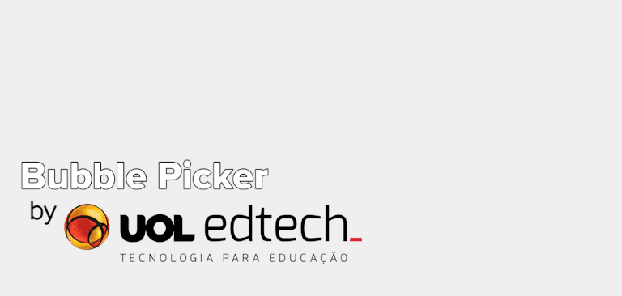

**UEBubblePicker** is inspired by Apple Music and builds upon it using freeform gestures and gravity simulation with UIKit Dynamics. UEBubblePicker is very flexible, letting you configure a bunch of properties and even **create your own bubbles**.

[](https://cocoapods.org/pods/UEBubblePicker)
[](https://cocoapods.org/pods/UEBubblePicker)
[](https://cocoapods.org/pods/UEBubblePicker)

## Features

* 🚀 **Many interactions**
	* Drag your bubbles around;
	* Remove bubbles on the fly (animated);
	* Change the attraction point by dragging your finger on the background
* 🤓 **Physics Customization**
	* Border collisions (whether the bubble can go or not through the screen borders);
	* Attraction point/anchor (by a percentage of the container's size);
	* Density for selected and unselected bubbles;
	* Resistance for bubbles
* 👩‍🎨 **Customizable Bubbles**
	* Create your own bubble subclassing `UEBubbleView` and implementing `UEBubbleViewLayoutProvider`;
	* Use our default bubble and change size, color, image, text, font

## Demo Example

Check out our example project! You can mess with the pod configurations and find out some interesting interactions by yourself.  
**Important:** clone the repo and run `pod install` in the Example directory first.

_note: this video uses default bubbles, but there's a custom bubble ready --_  
_change the customBubbles property in the View Controller_

  

## Real Example

This component was used in our app Sapiência Today. **_Behold_** some of the interactions you can do with it:

_note: screen transition animations were made using [Hero](https://github.com/HeroTransitions/Hero) and the refresh icon using [Lottie](https://github.com/airbnb/lottie-ios)_

  

## Requirements

* **Xcode 10+ (Swift 4.2-compatible)**

## Installation

UEBubblePicker is available through [CocoaPods](https://cocoapods.org). In order to install the pod, add the following line to your Podfile:

```ruby
pod 'UEBubblePicker', '~> 1.0'
```

## Simple Setup

### 1. Create the Container
Create an **`UEBubbleContainerView`**, either programmatically or using the Interface Builder.
_We recommend using the Interface Builder, as it allows you to freely change some settings before it appears, like scrollable directions, attraction point/anchor, etc._

Also, you might wanna implement **`UEBubbleContainerViewDelegate`** (and add it to UEBubbleContainerView) to know when a bubble is selected or deselected using `bubbleSelected(_:)` and `bubbleDeselected(_:)`

### 2. Create and add Bubbles
Create and add your Bubbles, using `createAndAddDefaultBubble(withData:tag:forceSelection:)` or `addBubble(_:onCenter:animated)`. More details below:


#### 2.1. **_Default Bubbles_**:

```swift  
func createAndAddDefaultBubble(withData: UEBubbleData!, tag: Int? = nil, forceSelection: Bool? = nil)
/// Creates a new **UEDefaultBubbleView**, using any data from **UEBubbleData**
/// - parameter withData: your data object. It customizes the view w/ images, colors, etc
/// - parameter tag: any tag (must be Int) can be used to identify your bubbles
/// - parameter forceSelection: force an initial state for your bubble, selected or not
```

**Important:** if you decide to create a Default Bubble, you have to pass an `UEBubbleData` object. It has 2 parts: the data, where you can set `image`, `text`; and the configuration, where you can set `minSize`, `maxSize`, `bgColor`, `imageUnselected` (alpha), `hasLabel` (Bool), `labelFont` and `labelColor` (label configurations won't do anything if you set hasLabel as false).

The default values for these properties are:

```swift  
/// UEBubbleData
public var image: UIImage? = nil
public var text: String = "UOL edtech_"
```

```swift  
/// UEBubbleConfiguration
// MARK: - Size Values
public var minSize: CGFloat = 80
public var maxSize: CGFloat = 80 * 1.33
    
// MARK: - Bubble Values
public var bgColor: UIColor = .black
    
// MARK: - Image Values
public var imageUnselected: CGFloat = 0.33
    
// MARK: - Label Values
public var hasLabel: Bool = true
public var labelFont: UIFont = UIFont.systemFont(ofSize: 12)
public var labelColor: UIColor = .white
```

#### 2.2. **_Custom Bubbles_**:

```swift
func addBubble(_ bubbleView: UEBubbleView!, onCenter: Bool = false, animated: Bool = true) throws
/// Adds a new bubble to the container. It can be a custom bubble, subclassing **UEBubbleView**
/// - parameter bubbleView: your bubble view. It could be an **UEDefaultBubbleView** or any **UEBubbleView** subclass
/// - throws: **UEBubbleContainerException.duplicateBubble**: if this bubble is already in the container
```


### 3.1. Get those bubbles! 

You can get them from these UEBubbleContainerView variables:

- `bubbles` or `allBubbles`: get all bubbles currently in the container;
- `selectedBubbles`: get all **selected** bubbles currently in the container;
- `unselectedBubbles`: get all **unselected** bubbles currently in the container.

Or these functions, if you want to be more specific:

- `bubblesWithTag(_:)`: recommended if you used a **Default** Bubble;
- `bubblesWhere(_:)`: recommended if you used a **Custom** Bubble. Pass a code block.

### 3.2. Remove those bubbles!?

You can use:

- `removeBubblesWithTag(_:)`: recommended if you used a **Default** Bubble;
- `removeBubblesWhere(_:)`: recommended if you used a **Custom** Bubble. Pass a code block;
- `removeBubble(_:)`: recommended if you have the bubble reference using **3.1.** methods. 

**Important:** Removing a bubble is **always** animated. Be careful with `layoutIfNeeded`.

## How to create your own bubble

The default bubble doesn't offer many options.  
In most cases you might want to create your own bubble -- fortunatelly, it's really easy.

Here we have a simple example:

```swift
import UIKit
import UEBubblePicker

public class UECustomBubbleView: UEBubbleView, UEBubbleViewLayoutProvider {
    
    private lazy var view = { return UIView() }()
    // Feel free to store anything you like into this view (ids, labels, etc)
    // e.g.: a category variable
    
    public func viewForBubble(_ bubbleView: UEBubbleView) -> UIView {
        self.view.backgroundColor = bubbleView.isSelected ? .blue : .red
        // You can provide a different view for each situation, based on any other data you put into this object
        // e.g.: put an image on the view, based on its category
        return self.view
    }
    
    public func sizeForBubble(_ bubbleView: UEBubbleView) -> CGFloat {
        return bubbleView.isSelected ? 96 : 48
    }
    
}
```

You need to subclass **`UEBubbleView`** and implement the **`UEBubbleViewLayoutProvider`** protocol.

The protocol asks for 2 methods:

- `viewForBubble(_:)` return a view that'll be displayed in the foreground of the bubble.
- `sizeForBubble(_:)` return the size of that bubble.

For both, you can use `bubbleView.isSelected` to find out whether the bubble is selected or not.

You can have anything you want in your `UEBubbleView` subclass. You might want to have a category ('artist', 'album', etc), provide a different view for each and find then using using `bubblesWhere(_:)`

## Planned Features
Some features we're planning for the (hopefully not far) future:

- **More customization options**
	- Enable/Disable background scrolling, for example.
- **Bubble cycling:**
    - What if you want to put a gazillion bubbles but you don't have the space for it? You might wanna cycle it. If you have a max of 20 on-screen, when you add a 21st, the 1st one of the stack is removed, and so on.

## Authors

**Iuri Chiba**:  
[iurichiba@gmail.com](mailto:iurichiba@gmail.com)  
[dom_ichiba@uolinc.com](mailto:dom_ichiba@uolinc.com)  

**Thiago Penna**:  
[tpenna@uolinc.com](mailto:tpenna@uolinc.com)

## License

UEBubblePicker is available under the MIT license. See the LICENSE file for more info.
